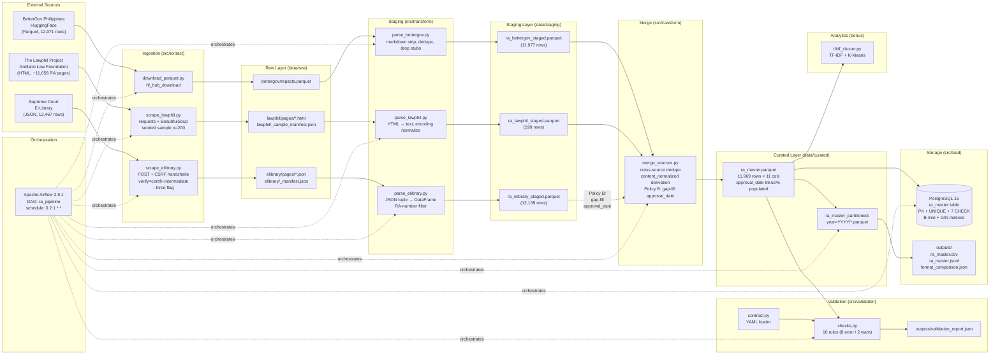

# Philippine Republic Acts — Data Engineering Pipeline

**DSS150P · Data Engineering · Group Beta**

**Francia, L. A. · Griño, S. R. · Pesquisa, J.**

An end-to-end data pipeline that ingests, transforms, validates, and stores
the full corpus of Philippine Republic Acts (RAs) as an analysis-ready
dataset for similarity analysis and policy consolidation research.

---

## Table of Contents

1. [Problem Statement](#1-problem-statement)
2. [Objectives](#2-objectives)
3. [Stakeholders](#3-stakeholders)
4. [Final Data Product](#4-final-data-product)
5. [Data Sources](#5-data-sources)
6. [Architecture](#6-architecture)
7. [Technology Stack](#7-technology-stack)
8. [Repository Structure](#8-repository-structure)
9. [Installation & Prerequisites](#9-installation--prerequisites)
10. [Configuration](#10-configuration)
11. [Starting the Environment](#11-starting-the-environment)
12. [Initializing PostgreSQL](#12-initializing-postgresql)
13. [Running the Pipeline](#13-running-the-pipeline)
14. [Inspecting Airflow](#14-inspecting-airflow)
15. [Data Quality & Validation](#15-data-quality--validation)
16. [Expected Outputs](#16-expected-outputs)
17. [Bonus Analytics — TF-IDF + K-Means](#17-bonus-analytics--tf-idf--k-means)
18. [Known Limitations](#18-known-limitations)
19. [Troubleshooting](#19-troubleshooting)
20. [Future Improvements](#20-future-improvements)

---

## 1. Problem Statement

The Philippines has issued 12,000+ Republic Acts across domains —
taxation, labor, environment, healthcare, franchise grants, civil
procedure. Many overlap thematically but are scattered across decades of
legislation with no systematic way to identify candidates for
consolidation. Legal researchers, policymakers, and governance analysts
lack a structured, queryable corpus to support evidence-based
consolidation analysis.

A one-off analysis cannot solve this. The corpus changes: new RAs pass,
sources update, and any useful tool must be **reproducible, automated,
and rerun-safe**. This project delivers that system.

## 2. Objectives

- Ingest RA data from **three heterogeneous sources** across **three
  wire formats** — Parquet, HTML, and JSON
- Build **Raw → Staging → Curated** layers with automated validation
- Store curated data in **PostgreSQL** and **partitioned Parquet**
- Orchestrate with **Apache Airflow** in **Docker**
- Produce a searchable, analysis-ready corpus (`ra_master`)
- Bonus: **TF-IDF + K-Means** to identify similar laws for consolidation

> **Scope.** The corpus is limited to the Republic Acts captured by the
> BetterGov snapshot (1946–2025). Prior Commonwealth Acts, Batas
> Pambansa, Executive Orders, and post-2025 RAs are out of scope. The
> pipeline is designed for rerun, not incremental sync.

## 3. Stakeholders

- **Policymakers and legislative analysts** — identify consolidation candidates
- **Legal researchers** — find related statutes across decades
- **Governance analysts** — evidence-based policy analysis

## 4. Final Data Product

`ra_master` — 11,969 rows, 11 columns, years 1946–2025,
`approval_date` **99.52% populated** (0.48% null).

- **PostgreSQL** table with primary key, unique constraint, 7 CHECK
  constraints, and 4 indexes (B-tree on `ra_year`, GIN full-text on
  `content_normalized`)
- **Partitioned Parquet** by `ra_year` (66 partitions, `year=YYYY/`)
- **CSV and NDJSON exports** for downstream consumers
- **Full-text searchable** on `content_normalized`
- **Contract-validated** (`docs/data_contract.yaml`, v1.2, 10 checks)
- **`approval_date` gap-filled from the Supreme Court E-Library** via
  Policy B — null rate reduced from 35.23% → 0.48% (4,159 dates
  recovered)

See `docs/data_dictionary.md` for the field-level reference.

## 5. Data Sources

**Three sources, three formats: Parquet + HTML + JSON.**

| Source | Format | Volume | Provider | License / Terms |
|---|---|---|---|---|
| BetterGov Philippines | **Parquet** (33.92 MB) | 12,071 rows | `bettergovph/gov-library` on HuggingFace | CC BY-NC 4.0 (non-commercial, attribution required) |
| The Lawphil Project | **HTML** (Windows-1252 on disk) | ~11,658 listed, 200 sampled | Arellano Law Foundation | Creative Commons — see lawphil.net for current terms; public legal reference material |
| Supreme Court of the Philippines — E-Library | **JSON** (datatables-shaped, `POST` response) | 12,467 rows | Supreme Court E-Library (`thebookshelf/showdocs`) | Public domain (Philippine government work) |

Full profiling: **`docs/source_profiling.md`** — provider, endpoint,
access date, retrieval method, and known limitations for each source.

**The three formats match the rubric's taxonomy literally:**

- **BetterGov = Parquet** — columnar file; retrieval is a file download
  via `hf_hub_download`.
- **Lawphil = HTML** — markup requiring DOM parsing; retrieval is an
  HTTP `GET` + `BeautifulSoup`.
- **E-Library = JSON** — a REST-style `POST` to
  `/republic_acts/fetch_ra` returning a structured JSON payload with no
  markup parsing; retrieval requires a CSRF handshake and a pinned TLS
  chain (see `docs/architecture.md` §3.9).

Three wire formats, three retrieval pipelines, three parsing strategies.
**All three sources are retrieved programmatically.** No manual
downloads, no committed scraped artifacts.

**Role separation:**

- **BetterGov** — the corpus base (11,969 curated rows derive from this
  source).
- **Lawphil** — a 200-RA cross-source validation set; contributes 0 net
  rows to the curated output.
- **E-Library** — a metadata-only enrichment source; contributes
  `approval_date` values via Policy B gap-fill (see
  `docs/data_flow.md` §2.1 and §4).

## 6. Architecture

See **`docs/architecture.md`** for the full architecture diagram,
component responsibilities, technology justifications, and layer
definitions.



*Renderers that don't support Mermaid: see `docs/data_flow.md` for the
equivalent linear representation.*

## 7. Technology Stack

| Layer | Technology |
|---|---|
| Language | Python 3.12 |
| Data | pandas, PyArrow, PyYAML |
| Storage | PostgreSQL 15 |
| Orchestration | Apache Airflow 2.9.1 |
| Containerization | Docker + Docker Compose |
| HTTP / scraping | `requests`, `beautifulsoup4`, `huggingface_hub`, `certifi` (+ shipped intermediate for E-Library TLS) |
| Analytics (bonus) | scikit-learn (TF-IDF, K-Means), matplotlib, Plotly |
| Static site | HTML + CSS; GitHub Pages (`docs/`) |

## 8. Repository Structure

```
ph-republic-acts-de/
├── README.md
├── requirements.txt
├── requirements-airflow.txt
├── Dockerfile
├── docker-compose.yml
├── .env.example                # template; copy to .env and fill secrets
├── .gitignore
├── .gitattributes
├── dags/
│   └── ra_pipeline.py          # single orchestration DAG
├── data/                       # bind-mounted into Airflow containers
│   ├── raw/                    # source-faithful (gitignored)
│   ├── staging/                # per-source cleaned (gitignored)
│   ├── profiling/              # results of source profiling (gitignored)
│   └── curated/                # final artifacts (committed)
├── certs/
│   ├── gsgccr3evtlsca2025.pem  # shipped intermediate (public; E-Library TLS)
│   └── README.md               # provenance + refresh procedure
├── docs/                       # GitHub Pages root (served)
│   ├── .nojekyll               # disable Jekyll processing
│   ├── index.html              # the analytics site
│   ├── assets/                 # site CSS + plot embeds (generated)
│   ├── data/                   # pre-computed JSON the site reads
│   ├── architecture.md
│   ├── data_flow.md
│   ├── data_contract.yaml
│   ├── data_dictionary.md
│   ├── erd.md
│   ├── idempotency.md
│   └── source_profiling.md
├── notebooks/                  # exploration only (not the pipeline)
├── outputs/                    # validation report, format comparison
├── sql/
│   ├── migrations/             # updates to DDL
│   └── schema.sql              # Postgres DDL
├── src/
│   ├── extract/                # download_parquet, scrape_lawphil, scrape_elibrary
│   ├── transform/              # parse_bettergov, parse_lawphil, parse_elibrary, merge_sources
│   ├── load/                   # load_postgres, write_partitions
│   ├── validation/             # contract, checks, profile sources
│   ├── analytics/              # tfidf_cluster, cluster_analysis, plots, temporal_eda, build_site
│   └── utils/                  # config, logger, io (atomic writers)
└── tests/
```

## 9. Installation & Prerequisites

**Required:**
- Docker Desktop (with Compose v2)
- Python 3.12 (only for running stages directly on the host; not needed
  if you only use Airflow)
- Git

**Not required (and deliberately avoided):** local `apache-airflow`
install. Python 3.12 + Airflow 2.9.1 has a known Pendulum build failure
on Windows. All orchestration runs inside the Docker image.

**First-time setup:**

```bash
git clone https://github.com/csystm/ph-republic-acts-de.git
cd ph-republic-acts-de

# Copy the env template and fill in secrets
cp .env.example .env
# Edit .env — see Configuration section below

# Build the Airflow image
docker compose build
```

## 10. Configuration

All configuration is externalized. `.env` is gitignored; `.env.example`
documents the schema.

**Required `.env` values:**

```env
# PostgreSQL (host view — the container has its own view, see below)
POSTGRES_USER=ra_user
POSTGRES_PASSWORD=<your password>
POSTGRES_DB=ra_db
POSTGRES_HOST=localhost
POSTGRES_PORT=5432

# Airflow (generate each with the commands shown)
AIRFLOW__CORE__FERNET_KEY=<Fernet.generate_key().decode()>
AIRFLOW__WEBSERVER__SECRET_KEY=<openssl rand -hex 32>

# Scraping
LAWPHIL_BASE_URL=https://lawphil.net/statutes/repacts/
LAWPHIL_SAMPLE_SIZE=200
```

**Generate the Fernet key** (must be 44-char urlsafe base64):
```bash
python -c "from cryptography.fernet import Fernet; print(Fernet.generate_key().decode())"
```

**Generate the webserver secret key:**
```bash
openssl rand -hex 32
```

**The `POSTGRES_HOST` layering**: `.env` uses `localhost` because the
host shell needs to reach the published port. Inside the Docker network,
`docker-compose.yml` injects `POSTGRES_HOST=postgres` for the Airflow
containers. Same database, two address spaces. **Do not** set
`POSTGRES_HOST=postgres` in `.env` — it will break host-side commands.

**Never commit `.env`.** Verify: `git check-ignore .env` should print `.env`.

## 11. Starting the Environment

```bash
# Start Postgres, Airflow init, webserver, scheduler
docker compose up -d

# Confirm all services healthy
docker compose ps
```

Expected services:
- `postgres` — healthy
- `airflow-init` — exited 0 (one-shot DB migration + admin user)
- `airflow-webserver` — up, port `8080`
- `airflow-scheduler` — up

**Airflow UI:** http://localhost:8080 — login `admin` / `admin`.

**Stop everything:**
```bash
docker compose down
```

**Stop and delete data volumes** (destroys Postgres data; raw/curated files survive on disk):
```bash
docker compose down -v
```

## 12. Initializing PostgreSQL

The `airflow-init` service creates the Airflow metadata DB
automatically. The **project's** `ra_master` table is created by the
DDL script:

```bash
docker compose exec -T postgres sh -c \
  'psql -U "$POSTGRES_USER" -d "$POSTGRES_DB"' < sql/schema.sql
```

Verify:

```bash
docker compose exec postgres sh -c \
  'psql -U "$POSTGRES_USER" -d "$POSTGRES_DB" -c "\d ra_master"'
```

You should see 11 columns, 1 primary key, 1 unique constraint, 7 CHECK
constraints, and 4 indexes.

The loader (`src.load.load_postgres`) is idempotent — safe to run before
or after the DDL, and safe to run repeatedly.

## 13. Running the Pipeline

### Via Airflow (recommended)

1. Open http://localhost:8080 → `ra_pipeline`
2. **Unpause** the DAG (toggle in the top-left)
3. Click **Trigger DAG w/ config**
4. Use `{}` for a fast run (reuses cached raw data), or
   `{"force_ingest": true}` for a full re-download + re-scrape
5. Watch the Graph view; all tasks should go green

### Directly from the host (development)

```bash
# Activate venv
.venv\Scripts\activate              # Windows
# source .venv/bin/activate         # macOS/Linux

# Run individual stages
python -m src.extract.download_parquet
python -m src.extract.scrape_lawphil
python -m src.extract.scrape_elibrary          # add --force to bypass skip-if-exists
python -m src.transform.parse_bettergov
python -m src.transform.parse_lawphil
python -m src.transform.parse_elibrary
python -m src.transform.merge_sources
python -m src.validation.checks
python -m src.load.load_postgres
python -m src.load.write_partitions
```

Each stage is idempotent. Rerunning any stage is safe.

### Bonus analytics (host only)

The bonus analytics reads the curated parquet and produces a static
GitHub Pages site. It is **not** part of the orchestrated DAG — the
mandatory pipeline ends at PostgreSQL; analytics is a downstream
consumer of `data/curated/ra_master.parquet` (rubric §3 explicitly
allows optional analytics outside the production pipeline).

```bash
python -m src.analytics.tfidf_cluster    # vectorize + k-sweep → metrics.json
python -m src.analytics.cluster_analysis # final fit + t-SNE + summaries
python -m src.analytics.plots            # PNG + Plotly embeds
python -m src.analytics.temporal_eda     # date-level EDA
python -m src.analytics.build_site       # assemble docs/index.html
```

Open `docs/index.html` to preview locally. Determinism: `random_state=42`
throughout; reruns are byte-identical.

## 14. Inspecting Airflow

**From the UI:**
- `ra_pipeline` → **Graph** view — task dependencies and states
- `ra_pipeline` → **Gantt** view — timeline (shows network-bound ingestion dominating)
- Click any task → **Log** — full stdout with record counts

**From the CLI:**

```bash
# List all DAGs
docker compose exec airflow-scheduler airflow dags list

# Show DAG schedule and next run
docker compose exec airflow-scheduler airflow dags details ra_pipeline

# List recent runs
docker compose exec airflow-scheduler airflow dags list-runs -d ra_pipeline

# Trigger with forced ingestion
docker compose exec airflow-scheduler airflow dags trigger ra_pipeline \
  --conf '{"force_ingest": true}'
```

**Schedule:** `0 2 1 * *` — monthly, 1st at 02:00 server time. The DAG
is intentionally paused for demo control; unpause to enable the schedule.

## 15. Data Quality & Validation

The contract lives at **`docs/data_contract.yaml`** (`contract_version: 1.2`).
It is the single source of truth for schema, types, nullability,
constraints, and validation rules. `src/validation/checks.py` derives all
its constants from it — editing the YAML changes pipeline behavior with
no code changes.

> **Scope note.** The contract's `source_allowed` set covers all three
> sources, but the curated `ra_master.source` column contains only
> `bettergov_parquet` (Policy B is gap-fill only — E-Library rows never
> enter the curated output). The `elibrary_json` allowed value exists so
> that a future change to the merge policy would not require a schema
> migration.

**10 checks, 8 errors (gate the pipeline), 2 warnings (report only):**

| # | Check | Severity |
|---|---|---|
| 1 | Schema conformance | error |
| 2 | `ra_id` uniqueness | error |
| 3 | Required non-null | error |
| 4 | Year range (1946–present+1) | error |
| 5 | Content non-stub | error |
| 6 | `content_normalized` non-empty | error |
| 7 | `ra_number` shape | error |
| 8 | `approval_date` valid ISO | error |
| 9 | Source distribution | warn |
| 10 | Oversized content (>500K chars) | warn |

**Latest run:** 9 pass, 1 warn, 0 fail. The warning is the three known
mega-statutes (RA-386, RA-5050, RA-8424) — legitimate codified statutes,
not a defect.

**Outputs:** `outputs/validation_report.json` — per-check status plus
sample violations for debugging.

## 16. Expected Outputs

| Path | Content | Committed? |
|---|---|---|
| `data/curated/ra_master.parquet` | 11,969 rows × 11 cols | **yes** |
| `data/curated/ra_master_partitioned/year=YYYY/` | 66 partitions | **yes** |
| `outputs/validation_report.json` | Per-check pass/warn/fail | **yes** |
| `outputs/format_comparison.json` | CSV/JSON/Parquet size + perf | **yes** |
| `outputs/ra_master.csv` | CSV export (167 MB) | no (regenerable) |
| `outputs/ra_master.jsonl` | NDJSON export (170 MB) | no (regenerable) |
| `data/raw/**` | Source-faithful raw | no (regenerable) |
| `data/staging/**` | Per-source cleaned | no (regenerable) |
| `docs/index.html` + `docs/assets/` + `docs/data/` | Static analytics site | **yes** |

**Postgres:** table `ra_master` — 11,969 rows.

**Selected-partition read** (faster than full scan by ~46× on one year):

```python
import pandas as pd
df = pd.read_parquet("data/curated/ra_master_partitioned/year=2015")
# 85 rows in 0.03s
```

## 17. Bonus Analytics — TF-IDF + K-Means

**Live site:** `https://csystm.github.io/ph-republic-acts-de/`

The bonus analytics addresses the project's original problem directly:
*which Republic Acts are similar enough to be consolidation candidates?*
It produces a static, publicly viewable site that any evaluator can
open in a browser without running anything.

### Method

Documents are vectorized from the pre-normalized `content_normalized`
column using `TfidfVectorizer(max_features=5000, min_df=5, max_df=0.3,
stop_words="english")`. The `max_df=0.3` cutoff removes corpus-wide
boilerplate (e.g. *section*, *provided*, *republic*) that would
otherwise dominate a generic "legislative language" cluster.

The three **mega-statutes** — RA-386 (Civil Code), RA-5050, and RA-8424
(NIRC amendments) — are excluded from the TF-IDF fit only. Each exceeds
500K characters and would otherwise pull every cluster centroid toward
codified-statute vocabulary. They remain in the curated parquet; this is
a documented analytics choice, not a data-quality rule.

K-Means is fit for **k = 2..30**; both inertia (elbow) and silhouette on
a 2,000-point sample are recorded. Final **k = 15** is chosen by an
elbow/silhouette consensus rule: if the global silhouette maximum is a
noise spike (margin < 0.02 over the elbow-adjacent peak), the
elbow-adjacent peak is used. Here the silhouette curve is flat past
k = 13, so k = 15 was chosen. For visualization, the TF-IDF matrix is
reduced by `TruncatedSVD(n_components=50)` and then projected to 2D with
`TSNE(perplexity=30, init="pca", random_state=42)`.

### Results

| Metric | Value |
|---|---|
| Working corpus | 11,966 RAs (3 mega-statutes dropped for the fit) |
| TF-IDF vocabulary | 5,000 terms (density 3.34%) |
| Final k | 15 |
| Final silhouette | 0.0815 |
| Elbow | k = 13 |
| Global silhouette max | k = 29 (spike; margin 0.0091 < 0.02) |

**Cluster themes.** 14 of 15 clusters are cleanly interpretable policy
themes: broadcasting franchises, telecom station permits, hospital
appropriations, hospital bed expansion, city charters, barrio creation,
electric franchises, ice-plant franchises, agricultural/vocational
appropriations, state universities and colleges, community education
and sports, school name changes, infrastructure/courts/holidays, and
provincial government fiscal offices. Cluster C12 captures numbered
line-item amendment boilerplate — a known limitation of bag-of-words
representations on template-heavy legal text.

**Temporal EDA** (enabled by Policy B's 99.52% `approval_date`
population):

- **1972–1987 gap** in enactments per year — the Martial Law period,
  during which laws were issued as Presidential Decrees and Batas
  Pambansa rather than Republic Acts.
- **Post-1987 surge** following the restoration of the bicameral
  Congress.
- **June spike** in month-of-approval — the congressional rush to
  adjournment (regular session ends in late May or early June).
- **Saturday concentration** (~33% of all enacted dates) — a pattern
  that **replicates independently across both source datasets** (33.8%
  in original BetterGov dates, 30.5% in E-Library-recovered dates), so
  it is not a single-source artifact. Likely a publication-date or
  recording convention.

### Rubric mapping (§ 7.1)

| Bonus area | Max | Delivered by |
|---|---|---|
| Meaningful EDA using curated data | +2 | Cluster size distribution, per-cluster year range, three temporal charts |
| Effective visualization / dashboard | +2 | Interactive Plotly scatter and top-terms charts + static PNG fallbacks |
| Appropriate statistical analysis | +2 | Elbow + silhouette across k=2..30; final metrics reported |
| Insights directly answer the problem | +2 | 15 named themes with representative RAs → candidate consolidation groups |
| Advanced analytics (ML) | +2 | TF-IDF + K-Means, method justified on the site |

### Reproduce

```bash
python -m src.analytics.tfidf_cluster
python -m src.analytics.cluster_analysis
python -m src.analytics.plots
python -m src.analytics.temporal_eda
python -m src.analytics.build_site
```

Site artifacts are committed under `docs/`. Regeneration is idempotent.

---

## 18. Known Limitations

Full list in `docs/data_contract.yaml` `limitations:` and
`docs/source_profiling.md`. The three that most affect downstream use:

1. **0.48% of rows (58 rows) have null `approval_date`.** Policy B
   recovered 4,159 dates from the Supreme Court E-Library (35.23% →
   0.48%). The residual 58 nulls are RAs whose approval dates are
   absent from both BetterGov and E-Library. Downstream analytics may
   fall back to `ra_year` for these.
2. **Three `ra_id` values appear under two source years each**
   (RA-6426, RA-7663, RA-7688). Merge keeps first-seen. Documented.
3. **Three mega-statutes exceed 500K chars.** The GIN full-text index
   truncates their tsvector content at ~1 MB; FTS over these rows is
   partial. Not a defect — codified statutes are legitimately large.

Additional limitations:
- The corpus is bounded by the BetterGov snapshot (1946–2025). The
  E-Library source extends to 2026, but Policy B does not append new
  RAs — those recent acts are visible in staging but not in the curated
  output.
- The Lawphil sample is a cross-source validation set, not a bulk
  contributor; it currently contributes 0 net rows.
- Coverage claims about "the corpus" refer to BetterGov only.
- E-Library `content_clean` is metadata-only (title-scale, ~180 chars
  median). It must not be blended into text-analytic downstream
  consumers — only BetterGov and Lawphil carry RA body text.

## 19. Troubleshooting

| Symptom | Likely cause | Fix |
|---|---|---|
| `role "root" does not exist` from psql | `.env` not loaded in host shell | Wrap in `sh -c`: `docker compose exec -T postgres sh -c 'psql -U "$POSTGRES_USER" -d "$POSTGRES_DB"'` |
| `could not translate host name "postgres"` (host) | `.env` has container hostname | Set `POSTGRES_HOST=localhost` in `.env` |
| `could not translate host name "localhost"` (container) | Missing container-side env override | Add `POSTGRES_HOST=postgres` to `x-airflow-common.environment` in `docker-compose.yml` |
| DAG import error: `NameError: name 'dag' is not defined` | `@dag` decorator used without import | Use `with DAG(...) as dag:` (classic form) |
| `FileNotFoundError: docs/data_contract.yaml` | `docs/` not mounted into container | Add `- ./docs:/opt/airflow/docs` to `x-airflow-common.volumes` |
| `RuntimeError: Could not find <table id='s-menu'>` | Wrong Lawphil index URL | Set `LAWPHIL_BASE_URL=https://lawphil.net/statutes/repacts/` (trailing slash, not `.html`) |
| `PermissionError: [Errno 13]` writing to `data/curated/` | Container UID vs. host file ownership (Windows) | Add `user: "0:0"` to `x-airflow-common` in `docker-compose.yml`; `docker compose up -d --force-recreate airflow-scheduler airflow-webserver` |
| Airflow webserver 8080 already in use | Another service bound to 8080 | `netstat -ano | findstr :8080`, kill or change port mapping |
| `Fernet key must be 32 url-safe base64-encoded bytes` | Fernet key not generated properly | `python -c "from cryptography.fernet import Fernet; print(Fernet.generate_key().decode())"` |
| Mojibake in Lawphil content | Encoding mismatch | Parser uses `apparent_encoding`; if issue persists, check `fetch_html` |

## 20. Future Improvements

- **Append recent RAs from E-Library**: the E-Library
  snapshot extends to 2026, one year past BetterGov's 2025 cap. A
  policy that appends E-Library-only RAs (not just gap-fills dates)
  would extend the corpus by one year. Deferred because it changes
  the corpus definition away from "BetterGov-derived" — a deliberate
  scope decision, not a technical gap.
- **Expand source diversity further**: add the Official Gazette and
  Congress.gov.ph for additional cross-source validation.
- **Incremental ingestion**: track a high-water-mark on `ra_year` and
  only fetch new RAs on each run. Currently the pipeline re-processes
  the full snapshot.
- **Language model embeddings**: replace TF-IDF with sentence
  embeddings (e.g., `sentence-transformers`) for semantic similarity,
  which handles paraphrase better than bag-of-words.
- **Full-text index per partition**: the GIN index is global; on a
  partitioned materialization, per-partition indexes could be faster
  for year-scoped queries.
- **Snowflake-style SCD Type 2**: track RA amendments over time as a
  history table, allowing queries like "what did RA 10960 look like
  before the 2020 amendment?"
- **Great Expectations integration**: replace bespoke checks with a
  standard validation framework if this grows beyond the course project.

---

## License & Attribution

Course project — DSS150P, Group Beta.
Project source code is provided for academic evaluation.

**Third-party data retains its original license:**

| Source | License / Terms | Required attribution |
|---|---|---|
| BetterGov (`bettergovph/gov-library`) | CC BY-NC 4.0 | Attribute BetterGov Philippines; non-commercial use only |
| The Lawphil Project | Creative Commons (see lawphil.net) | Attribute the Arellano Law Foundation |
| Supreme Court E-Library | Public domain (Philippine government work) | Government works are not subject to copyright; cited as the Supreme Court of the Philippines |

**TLS certificate.** The intermediate certificate
`certs/gsgccr3evtlsca2025.pem` is a **public** certificate authority
intermediate (no private key, no secrets). It is committed for
reproducibility of the E-Library TLS handshake. See `certs/README.md`
for provenance and refresh procedure.