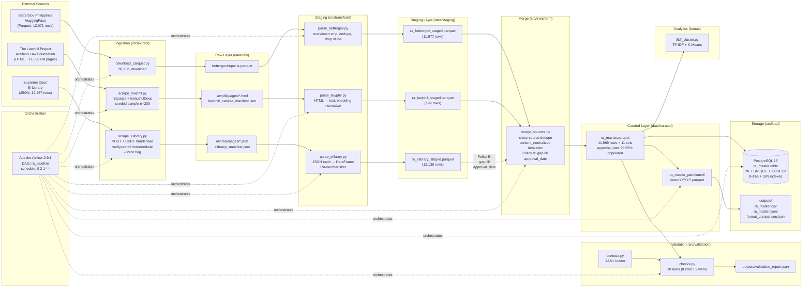

# Architecture — Philippine Republic Acts Data Pipeline

**Project:** Text mining Philippine Republic Acts for similarity analysis and policy consolidation
**Course:** DSS150P Data Engineering
**Last updated:** 2026-10-06

---

## 1. Overview

The system ingests Philippine Republic Acts (RAs) from three heterogeneous
sources across three wire formats (Parquet, HTML, JSON), transforms them
through a three-layer Raw → Staging → Curated pipeline, validates every
curated row against a machine-readable data contract, and produces a
single analysis-ready corpus (`ra_master`) stored in PostgreSQL,
partitioned Parquet, and CSV/JSON exports.

The three sources serve distinct roles:

- **BetterGov Parquet** — the corpus base. Bulk coverage (12,071 raw /
  11,977 staged rows), full RA body text.
- **Lawphil HTML** — a 200-RA cross-source validation set. Same acts as
  the base, profiled via an independent HTML pipeline.
- **Supreme Court E-Library JSON** — a metadata-only enrichment source.
  Gap-fills `approval_date` on BetterGov rows via **Policy B** (see §3.5).

The entire pipeline is orchestrated by a single Apache Airflow DAG and runs
inside Docker Compose. Every stage is idempotent, every file write is atomic,
and every validation failure surfaces through logs, an exit code, and a
structured `validation_report.json`.

The final curated dataset (11,969 rows, 1946–2025, `approval_date` 99.52%
populated) supports:
- similarity analysis between statutes (TF-IDF + clustering, bonus),
- full-text search over normalized content,
- year-partitioned analytical scans,
- and reproducible downstream analytics.

---

## 2. System Architecture



*Renderers that don't support Mermaid: see `docs/data_flow.md` for the
equivalent linear representation.*

**Required classification statement.** *The third source is a JSON API,
not HTML scraping.* E-Library retrieval is a `POST` to a REST endpoint
that returns a datatables-shaped JSON response; no markup is parsed. See
§3.1 for the format taxonomy.

---

## 3. Component Responsibilities

### 3.1 External Sources

**Three sources, three formats: Parquet + HTML + JSON.**

| Source | Format | Volume | Retrieval |
|---|---|---|---|
| BetterGov Philippines (`bettergovph/gov-library`) | Parquet, 33.92 MB | 12,071 rows | `huggingface_hub.hf_hub_download` |
| The Lawphil Project (Arellano Law Foundation) | HTML (Windows-1252 on disk) | ~11,658 listed RAs, 200 sampled | `requests` GET + `BeautifulSoup` DOM parse |
| Supreme Court of the Philippines — E-Library | JSON (datatables-shaped) | 12,467 rows | `requests` POST + CSRF handshake, `verify=<cert bundle>` |

**The three sources match the rubric's format enumeration literally:**
Parquet (columnar file), HTML (markup requiring DOM parsing), JSON (a
REST-style POST returning a structured payload — no markup parsing).
Three wire formats, three retrieval pipelines, three parsing strategies.

See `docs/source_profiling.md` for the full profiling report — row/column
counts, null rates, duplicates, encoding issues, and known limitations.

### 3.2 Ingestion (`src/extract/`)

- **`download_parquet.py`** — retrieves the BetterGov Parquet file from
  HuggingFace via `hf_hub_download` (which handles redirects and caching
  natively; the plain `requests` path was rejected due to a redirect hang).
  Idempotent: re-download skips if the file is cached and unchanged.

- **`scrape_lawphil.py`** — fetches the Lawphil index, parses ~11,658
  republic act entries, samples 200 with a fixed seed (`seed=42`), and
  fetches each page with a 0.5s polite delay. **Skip-if-exists caching**
  ensures repeated runs do not re-fetch pages already on disk.

- **`scrape_elibrary.py`** — fetches the Supreme Court E-Library index
  via `POST /republic_acts/fetch_ra`. Requires a **CSRF handshake**: an
  initial `GET` primes the session cookie and scrapes the CSRF token,
  which is then supplied on every `POST`. Page size is configured by
  `ELIBRARY_PAGE_SIZE`. The `--force` flag bypasses the skip-if-exists
  default and re-fetches every page; the DAG passes `--force` when the
  `force_ingest` parameter is `true` (see §3.8). TLS uses `certifi` plus
  a **shipped intermediate certificate** at
  `certs/gsgccr3evtlsca2025.pem` — see §3.9 for the reason.

All writes route through `src/utils/io.py::atomic_write_*`, which writes
to `<dest>.part` and then `os.replace()`. Readers never observe a partial
file. `.part` is gitignored.

### 3.3 Raw Layer (`data/raw/`)

Source-faithful storage. **No transformation.** Files are preserved as
close to the retrieval form as practical for traceability. Gitignored
(regenerable from source). All three sources' raw artifacts live here:

- `data/raw/bettergov/repacts.parquet`
- `data/raw/lawphil/_sample_manifest.json` + `pages/*.html`
- `data/raw/elibrary/_manifest.json` + `pages/*.json`

### 3.4 Staging (`src/transform/parse_*.py`)

Three parsers, one per source format:

- **`parse_bettergov.py`** — strips markdown (links, bold markers, inline
  headers), recovers RA numbers from inline headers when the `month`
  column is null, drops year-level index rows (`basename ~ ^ra\d{4}$`),
  and tags each row with `source="bettergov_parquet"` and its
  `source_path`.

- **`parse_lawphil.py`** — parses HTML bodies (blockquote or dir nesting,
  both handled), normalizes Windows-1252 mojibake via
  `r.apparent_encoding`, applies NFKC normalization, and tags each row
  with `source="lawphil_html"`.

- **`parse_elibrary.py`** — parses the datatables-shaped JSON tuple
  `[title, approval_date, html_anchor]` into a 10-column DataFrame. Drops
  non-RA rows via the filter `^REPUBLIC ACT NO\. \d+$` on the title,
  dedupes on `ra_number`, extracts the `doc_id` from the anchor href
  (`showdocs/<n>/<doc_id>`) into `source_path`, and populates
  `content_clean` from the descriptive title. Tags rows with
  `source="elibrary_json"`.

Staging writes are atomic; the `.part` file is cleaned up on failure.

### 3.5 Curated Layer (`src/transform/merge_sources.py`)

The only place cross-source integration happens:

1. **Diagnostic pass** — logs duplicate `ra_id` values, oversized rows,
   and stub rows before any drop occurs. Diagnosis is separated from
   mutation.
2. **Drop rules** — stubs (`word_count < 5`), intra-source dedupe
   (`ra_id`, `keep="first"`).
3. **Cross-source merge (Lawphil)** — Lawphil rows whose `ra_id` also
   appears in BetterGov are dropped. Lawphil acts as a **cross-source
   validation set**, not a bulk contributor. (In this snapshot: 199/199
   overlap → 0 Lawphil-only rows retained. The code retains Lawphil-only
   rows if the source ever produces them.)
4. **Policy B — `approval_date` gap-fill from E-Library.** For each
   curated row with a null `approval_date`, look up the same `ra_number`
   in the E-Library staged parquet and copy its `approval_date` if
   present. E-Library rows themselves are **not** appended to the curated
   dataset. The `source` column remains `{bettergov_parquet: 11,969}`.
   Effect: `approval_date` null rate 35.23% → **0.48%** (4,159 dates
   recovered; 58 residual nulls).
5. **Derived column** — `content_normalized`: NFKC, quote/dash
   canonicalization, lowercase, boilerplate strip (RA header, enactment
   clause, section markers, approval line), whitespace collapse.
6. **Atomic write** to `data/curated/ra_master.parquet`.

**Reconciliation:** 11,977 (BetterGov staged) − 5 stubs − 3 dedupe =
**11,969**.

### 3.6 Validation (`src/validation/`)

- **`contract.py`** — loads `docs/data_contract.yaml` via `PyYAML` and
  exposes `expected_columns`, `required_non_null`, `rules`, `rule_params`,
  and `field` accessors. `@lru_cache`-backed; parsed once per process.
  Field types map to pandas dtypes (`string → object`,
  `integer → Int64`, `string+date → object`).

- **`checks.py`** — 10 checks, each returning a `CheckResult` with
  `severity` (`error`/`warn`) and `status` (`pass`/`warn`/`fail`).
  Contract-derived constants (no hardcoded thresholds). Errors gate the
  pipeline via exit code 1; warnings report only. Every check surfaces
  sample violations for debugging.

| # | Check | Severity |
|---|---|---|
| 1 | `schema_conformance` | error |
| 2 | `ra_id_unique` | error |
| 3 | `required_non_null` | error |
| 4 | `year_range` | error |
| 5 | `content_non_stub` | error |
| 6 | `content_normalized_non_empty` | error |
| 7 | `ra_number_shape` | error |
| 8 | `approval_date_valid` | error |
| 9 | `source_distribution` | warn |
| 10 | `oversized_content` | warn |

Output: `outputs/validation_report.json` (per-check status + samples).

### 3.7 Storage (`src/load/`)

- **`load_postgres.py`** — reads the curated Parquet, coerces pandas
  nullable types to psycopg2-safe Python types, and upserts in 500-row
  chunks using `INSERT ... ON CONFLICT (ra_id) DO UPDATE`. The
  `RETURNING (xmax = 0)` trick distinguishes inserted vs updated rows in
  a single round-trip per chunk. Reconciliation check: `inserted + updated
  == len(records)`, else fail.

- **`write_partitions.py`** — writes Hive-style partitioned Parquet
  (`year=YYYY/ra_master.parquet`) via per-partition `.part` + `os.replace`,
  then sweeps stale year folders. Emits CSV and NDJSON exports plus a
  `format_comparison.json` with size/write/read metrics per format.

### 3.8 Orchestration (`dags/ra_pipeline.py`)

Single DAG, `schedule="0 2 1 * *"` (monthly, 1st, 02:00). Task groups
mirror the pipeline stages:

```
ingest {download_parquet, scrape_lawphil, scrape_elibrary}
  ↓
transform {parse_bettergov, parse_lawphil, parse_elibrary} → merge_sources
  ↓
run_checks
  ↓
load {load_postgres, write_partitions}
  ↓
verify_outputs
```

- Every task invokes a module via `BashOperator` with
  `cd /opt/airflow && python -m src.<...>`. The DAG has no imports from
  `src`, so a broken module can never crash the scheduler at parse time.
- `retries=2` with 1-minute backoff by default; ingestion tasks get
  `retries=3` with longer timeouts (network-bound); `run_checks` gets
  `retries=0` (a validation failure is a data problem — retrying won't
  help).
- Parameter `force_ingest` (default `False`) gates network-bound
  ingestion. With `False`, ingestion tasks print `[skip]` and reuse
  cached raw data (fast demo path). With `True`, each ingestion module
  is invoked with its `--force` flag via `_ingest_cmd(module, force_arg)`
  — for `scrape_elibrary` this re-fetches every page and bypasses
  skip-if-exists.
- `max_active_runs=1` prevents racing writes to shared output files.
- `catchup=False` + `start_date=2026-09-30` avoids backfill storms.

### 3.9 Containerization and TLS

`Dockerfile` extends `apache/airflow:2.9.1-python3.12` with project
dependencies. `docker-compose.yml` orchestrates four services:

| Service | Image | Purpose |
|---|---|---|
| `postgres` | `postgres:15` | Structured storage; named volume `postgres_data` |
| `airflow-init` | project Dockerfile | One-shot: DB migrate + admin user create |
| `airflow-webserver` | project Dockerfile | UI on `localhost:8080` |
| `airflow-scheduler` | project Dockerfile | DAG scheduling and execution |

The Airflow services share an `x-airflow-common` YAML anchor for env
vars and mounts. Bind mounts expose `dags/`, `src/`, `data/`, `config/`,
`sql/`, `outputs/`, `docs/`, and `certs/` inside the container at
`/opt/airflow/<name>/`.

**Environment layering.** The *host* view of Postgres is `localhost:5432`
(used by direct `python -m src.load.load_postgres` from the venv). The
*container* view is `postgres:5432` (set in `x-airflow-common.environment`
as a literal, not interpolated). Same database, two address spaces.

**TLS certificate handling.** The E-Library server sends an **incomplete
certificate chain** — it omits one or more intermediate certificates
between its leaf and a trusted root. Windows performs *AIA fetching*
(automatically retrieving missing intermediates from the leaf's Authority
Information Access extension) and therefore silently repairs the chain;
OpenSSL (used by Python's `requests` and by Docker containers) does not,
and raises `SSLError: certificate verify failed` on the same request.

The initial implementation used the `truststore` package to delegate
verification to the host OS trust store (which on Windows sidesteps the
problem). That approach was rejected because it silently behaves
differently between Windows and Linux — precisely the reproducibility
hazard this course penalizes. The current implementation is explicit:

- Root trust comes from **`certifi`** (vendored, deterministic, identical
  in every environment).
- The missing intermediate is **shipped in-tree** as
  `certs/gsgccr3evtlsca2025.pem` and mounted into the container via
  `docker-compose.yml`.
- `scrape_elibrary` passes `verify=<certifi bundle + shipped intermediate>`
  explicitly on every request.

`certs/README.md` documents the certificate's provenance, the refresh
procedure, and the reason for its inclusion. `.gitattributes` pins
`*.crt` and `*.pem` to `-text` so line endings don't corrupt the PEM
envelope. This is a deliberate reproducibility decision, not a workaround.

### 3.10 Analytics (bonus)

`src/analytics/tfidf_cluster.py` (planned) runs TF-IDF vectorization over
`content_normalized` and K-Means clustering to surface similar statutes.
**Tokenization happens in the analytics layer only — never persisted to
the curated layer.**

---

## 4. Data Contract

`docs/data_contract.yaml` (`contract_version: 1.2`) is the single source
of truth for schema, nullability, unique constraints, and validation
thresholds. `checks.py` derives its constants from the contract via
`contract.py`. Editing the YAML changes pipeline behavior — no schema
facts are hardcoded in code.

Key elements:
- 11 fields: `ra_id, ra_number, ra_year, title, approval_date,
  content_clean, content_normalized, content_length, word_count, source,
  source_path`
- Primary key: `ra_id`
- Unique constraint: `(ra_number, ra_year)`
- `source_allowed: [bettergov_parquet, lawphil_html, elibrary_json]`
  (extended by `sql/migrations/002_extend_source_allowed.sql`)
- 10 validation rules (8 error, 2 warn)
- Documented limitations: coverage skew, residual `approval_date`
  nullability, 3 duplicate `ra_id` collisions, 3 mega-statutes,
  Lawphil overlap

See `docs/data_dictionary.md` for the human-readable companion.

---

## 5. Technology Choices and Justifications

| Choice | Justification |
|---|---|
| **Python 3.12** | Course standard; mature ecosystem for parquet, HTTP, and ML. |
| **Parquet** for raw/staging/curated | Columnar, compressed, schema-in-footer. 64 MB curated vs. 167 MB CSV (~2.6× smaller). Read is 4–5× faster for column-selective workloads. |
| **JSON via POST** (E-Library) | The provider exposes no bulk file download; the only available interface is a datatables-style REST endpoint behind a CSRF handshake. Format matches the response shape. |
| **PostgreSQL 15** | Required by the course. Rich constraint support (CHECK, UNIQUE, GIN) lets the storage layer enforce the same rules the pipeline already does — defense in depth. |
| **Apache Airflow 2.9.1** | Course standard. Task groups, retries, and parameterization fit the pipeline's stage structure. |
| **Docker Compose** | Reproducible multi-service environment. Airflow + Postgres are non-trivially coupled; Compose handles healthchecks, dependency ordering, and volume mounts. |
| **PyYAML** (contract) | Machine-readable, human-editable, version-controllable. Aligns with prior lab activities. |
| **`hf_hub_download`** over `requests` | Handles HuggingFace redirects natively. The plain-`requests` path was observed to hang on the redirect. |
| **`certifi` + shipped intermediate** over `truststore` | Explicit, identical behavior on Windows and Linux. `truststore` silently delegates to the OS trust store, producing Windows-only TLS success — a reproducibility hazard. See §3.9. |
| **Atomic writes (temp + `os.replace`)** | The primitive that makes every file writer rerun-safe. `.part` is gitignored; readers never see partial files. |
| **Upsert on `ra_id`** | The primitive that makes Postgres load rerun-safe. Idempotent: `Inserted: 0 | Updated: 11,969` on every rerun. |
| **Hive-style partition** `year=YYYY/` | Auto-detected by pandas/Spark/DuckDB; zero-cost partition pruning on year-range filters. |
| **NDJSON for JSON export** | Streaming-friendly. A single JSON array would force loading the full 170 MB into memory to read one record. |
| **Monthly schedule (`0 2 1 * *`)** | RAs are enacted at ~3–4/week, irregularly. Daily would be ~30 redundant runs/month. Monthly gives a defensible ~30-day freshness bound. |

---

## 6. Layer Responsibilities (summary)

| Layer | Transformation allowed | Output form |
|---|---|---|
| **Raw** | None. Source-faithful. | Parquet / HTML / JSON as retrieved |
| **Staging** | Cleaning, type coercion, per-source standardization, drop of non-RA artifacts | One parquet per source |
| **Curated** | Cross-source integration, dedupe, derived columns, contract conformance, Policy B gap-fill | Single `ra_master.parquet` |
| **Storage** | Type coercion only; no new derivation | Postgres table, partitioned parquet, CSV, JSONL |

Destructive manual preprocessing before ingestion is avoided. All
transformations are performed by committed, tested code.

---

## 7. Reliability, Rerun Safety, and Failure Handling

| Concern | Mechanism |
|---|---|
| File write races | `.part` + `os.replace()`, `.part` cleaned on failure |
| Postgres duplicate rows | `INSERT ... ON CONFLICT (ra_id) DO UPDATE` |
| Partial-run partitions | Per-partition `.part` + `os.replace`; stale folders swept |
| Bad data reaching storage | Contract-driven `checks.py`; errors exit-1 gate the DAG |
| Broken module at DAG parse | DAG has no imports from `src`; each task is `python -m src.<...>` |
| Transient network failure | `retries=3` on ingestion tasks; scrape skips individual failures and logs a warning |
| Data-issue failures | `retries=0` on `run_checks` — retrying a data problem doesn't help |
| Concurrent runs racing on shared files | `max_active_runs=1` |
| Backfill storm on first unpause | `catchup=False`, `start_date=today` |
| Silent success with empty outputs | `verify_outputs` task asserts presence of the three graded artifacts |
| E-Library TLS chain failure | `verify=<certifi + shipped intermediate>`; no OS-dependent fallback. See §3.9. |
| E-Library CSRF rejection | Handshake re-primes the token on every run; failure surfaces as a red task on `ingest.scrape_elibrary` |

---

## 8. Out of Scope / Non-Goals

- Language-specific FTS analyzers (we use the built-in `english` config).
- Re-partitioning by anything other than `ra_year` (year is the natural
  analytical axis; other candidate keys like `source` have too few
  distinct values).
- Full historical RAs beyond the union of BetterGov + E-Library snapshots
  (source-limited).
- Real-time ingestion (the sources publish on a monthly-ish cadence).
- Storing raw HTML or raw JSON in Postgres (the raw layer is the system
  of record for source-faithful data).
- Blending E-Library `content_clean` (title-scale, metadata-only) into
  text-analytic downstream consumers.

---

## 9. Known Limitations

See `docs/source_profiling.md` §4 and §5 and `docs/data_contract.yaml`
`limitations:` for the full list. The four that most affect downstream
consumers:

1. **`approval_date` remains null in 0.48% of rows (58 rows)** after
   Policy B gap-fill. These are RAs whose approval dates are absent from
   both BetterGov and E-Library. Downstream analytics may fall back to
   `ra_year` for these.
2. **Three `ra_id` values appear under two source years each**
   (RA-6426, RA-7663, RA-7688). Merge keeps first-seen. Documented, not
   a bug.
3. **Three mega-statutes exceed 500K chars** (RA-386, RA-5050, RA-8424).
   The GIN full-text index truncates their tsvector content at ~1 MB;
   FTS over these rows is partial. Codified statutes are legitimately
   large — not a source defect.
4. **E-Library coverage extends to 2026** (BetterGov stops at 2025).
   Those recent RAs are visible in the E-Library raw and staged layers
   but are not present in the curated `ra_master` — Policy B uses
   E-Library only for gap-fill on existing BetterGov rows, and does not
   add new RAs to the corpus. A future "Policy C" could append them, but
   is out of scope for this submission.